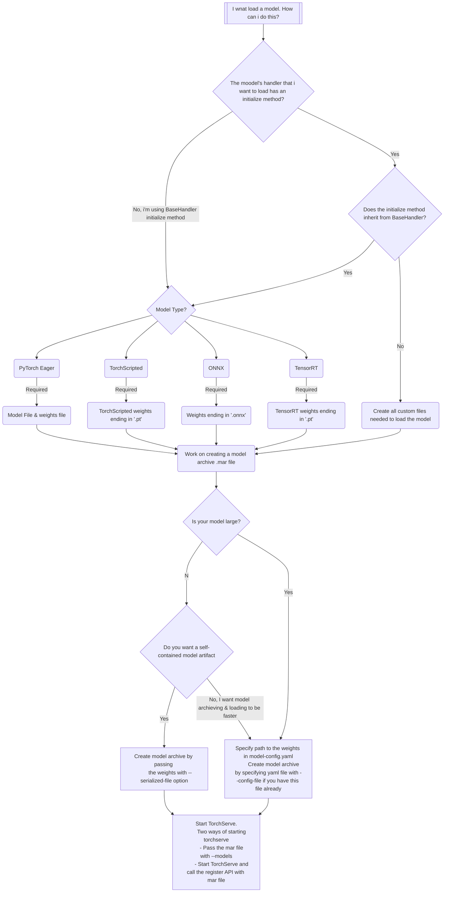

# How to create and load a model in Torchserve
In the bottom of this page you will find a statechart that shows the steps involved in creating and loading a model in Torchserve. The steps are explained in detail below.

